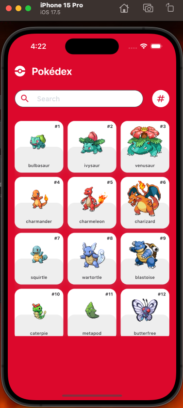
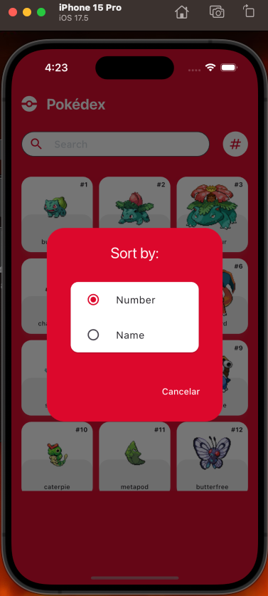
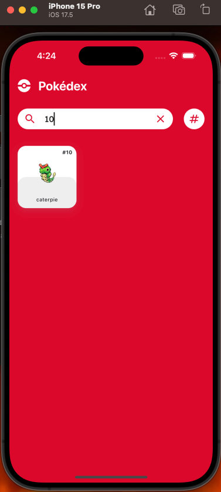
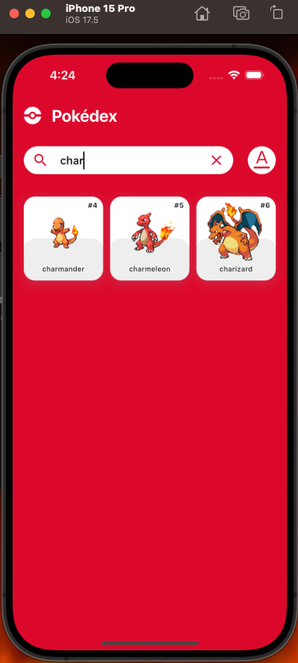
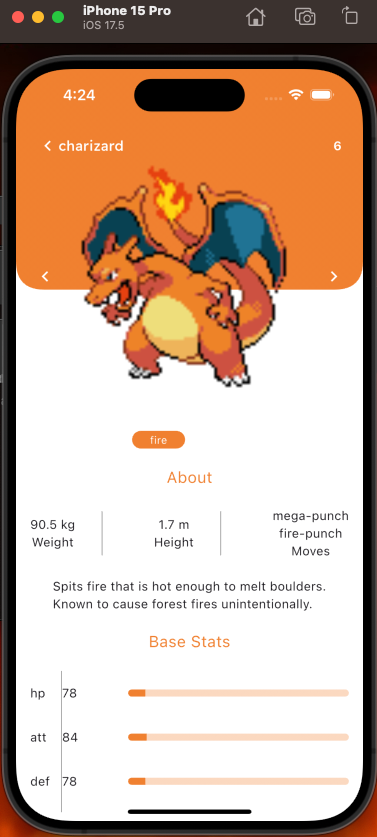

# pokeApp

Aplicación para mostrar el listado de pokemons y sus detalles

### Ejecutar proyecto:

Ejecutar el comando Flutter run

### Estructura del proyecto:







### Estructura del proyecto:

```
lib/
│
├── src/
│   ├── AtomicModel-UI/  -------------------------------- Section to separate the UI
│   │   ├── atoms/       -------------------------------- Basic widgets as Input, Buttons, Labels
│   │   ├── molecules/   -------------------------------- Union between two or more atoms
│   │   ├── organisms/   -------------------------------- Interaction between molecules
│   │   └── utils/       -------------------------------- Utilities such as validations
│   └── App/             -------------------------------- Clean Architecture
│       ├── Core/        -------------------------------- Shared global functionalities
│       │   ├── errors/  -------------------------------- Classes for handling errors and exceptions.
│       │   ├── useCases/ ------------------------------- General use cases, such as a base or abstract use case.
│       │   ├── utils/    ------------------------------- Utility functions such as validations or formatting.
│       │   ├── constants/ ------------------------------ Global constant values (eg. routes, strings, API keys).
│       │   │
│       └── Features/    -------------------------------- different features or modules of the application
│           └── Login/   -------------------------------- this is an example to feature
│               ├── domain/
│               │   ├── entities/ ----------------------- Classes that represent domain entities (fundamental objects in the business). Example: User, Profile
│               │   ├── repositories/ ------------------- Interfaces that define repository contracts. Example: Authentication Repository.
│               │   └── useCases/ ----------------------- Classes that implement the logic of the use cases. Example: Login, Register, GetUserProfile.
│               ├── data/
│               │   ├── models/ ------------------------- Classes that implement data models (typically used to serialize and deserialize data from the API). Example: UserModel.
│               │   ├── datasources/ -------------------- External data sources, such as APIs, databases, etc. Example: RemoteDataSource, LocalDataSource.
│               │   └── repositories/ ------------------- Concrete implementations of the repositories defined in the domain.
│               └── presentation/
│                   ├── widgets/ ------------------------ Reusable UI widgets. Example: buttons, inputs.
│                   ├── pages/ -------------------------- Pages or screens. Example: LoginPage, RegisterPage.
│                   └── cubit/ -------------------------- Here would go the state logic with events and states.
├── test/
├── ios/
├── android/
└── web/
```

## Flutter Documentation

For help getting started with Flutter development, view the
[online documentation](https://docs.flutter.dev/), which offers tutorials,
samples, guidance on mobile development, and a full API reference.